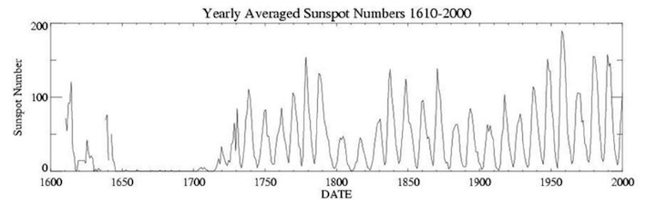
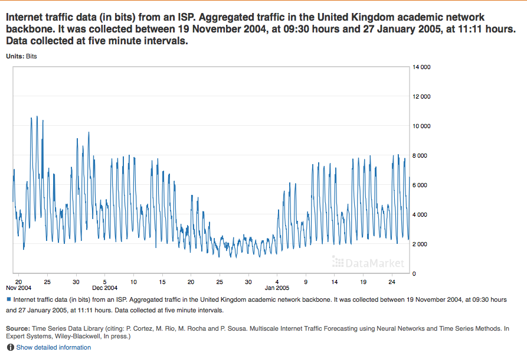

```{r chunk_setup, echo = FALSE}
knitr::opts_chunk$set(warning = FALSE, 
                      message = FALSE, 
                      comment = "",
                      fig.align = "center", 
                      fig.show = "hold",
                      fig.height = 4,
                      fig.width = 8,
                      out.width = "80%") 
```

```{r options_setup, echo = FALSE}
options(scipen = 999) #- para quitar la notacion cientifica
```

```{r librerias, echo = FALSE}
library(forecast)
library(ggplot2); theme_set(theme_bw())
library(gridExtra)
library(grid)
```

# Introducción

Las __series temporales__ se analizan para entender el pasado y predecir el futuro posibilitando a los agentes tomar decisiones adecuadamente informados.

* Algunas cabeceras de prensa determinan el número de ejemplares a imprimir cada día analizando la demanda pasada de su diario.

* [Red Eléctrica Española](https://demanda.ree.es/demanda.html) predice el consumo eléctrico hora a hora para ajustar la oferta a la demanda.

* El [Instituto Nacional de Estadística](http://www.ine.es/dyngs/INEbase/es/operacion.htm?c=Estadistica_C&cid=1254736176953&menu=ultiDatos&idp=1254735572981) (INE) predice la población española para los próximos 50 años. 

La predicción de series temporales es una herramienta a la hora de establecer políticas sociales, empresariales...

\
\

# Series Temporales

\

## Definición

__Una serie temporal es una variable medida secuencialmente en el tiempo a intervalos equi-espaciados__.

La representaremos por,
  $$\{y_t\}_{t=1}^T=\{y_1,y_2,\ldots,y_T\}.$$

La serie aparece indexada por su fechado $t$ y el sub-índice $T$ hará siempre referencia a la fecha del último dato.

El fechado varía en su frecuencia, que puede ser anual (baja frecuencia), trimestral, mensual, semanal, diario (alta frecuencia) o disponer casi de un continuo de datos.

En este curso aprenderemos a ajustar modelos a series temporales para su posterior análisis y predicción.

\

## Proceso generador de datos

El proceso generador de los datos de una serie temporal es en general desconocido, pero se puede aproximar por un modelo estadístico. Estos modelos se pueden clasificar en tres grandes grupos según su naturaleza.

En ocasiones las series temporales pueden ser modeladas de forma __determinista__ ajustando los datos a funciones matemáticas: $$y_t=f(t)+\varepsilon_t.$$

En los __procesos estocásticos__ las observaciones cercanas en el tiempo tienden a estar (cor)relacionadas y se puede aprovechar esta dependencia para entender la serie y predecirla: 
$$y_t=f(y_{t-1},y_{t-2},\ldots)+\varepsilon_t.$$

A veces, ambas situaciones se dan simultáneamente:
$$y_t=f(t,y_{t-1},y_{t-2},\ldots)+\varepsilon_t.$$

La figura 1 muestra un ejemplo gráfico de estos tres procesos generadores.

```{r procesosGeneradores, echo = FALSE}
set.seed(123456)
trend <- 1:500
e <- rnorm(500)
rw <- cumsum(e)
rw <- (rw - min(rw)) * 250 / (max(rw) - min(rw))
rw.de <- 0.5 * trend + 2 * cumsum(e)
dt <- 0.1 * e + 0.5 * trend

dt <- ts(dt, start = 1, freq = 1)
rw <- ts(rw, start = 1, freq = 1)
rw.de <- ts(rw.de, start = 1, freq = 1)

autoplot(dt, series="Determinista",
         xlab = "",
         ylab = "",
         main = "Figura 1: Ejemplos de procesos generadores") +
  autolayer(rw, series = "Estocástico") +
  autolayer(rw.de, series = "Ambos") +
  scale_colour_manual(values=c("Determinista"="blue",
                               "Estocástico"="olivedrab", 
                               "Ambos" = "brown"),
                      breaks=c("Determinista","Estocástico", "Ambos")) +
  guides(colour = guide_legend(title = "Procesos generadores")) + 
  scale_x_continuous(breaks=NULL) + 
  scale_y_continuous(breaks=NULL) + 
  theme(legend.position=c(0.98,0.02), legend.justification=c(1,0))
```

En este curso se asumirá en todo momento que la serie temporal tiene una componente estocástica. 

\

## Lectura de datos y representación gráfica

Antes de continuar vamos a importar en `R` dos de las series que usaremos de ejemplo en este tema: número de títulos (libros y folletos) publicados anualmente en España y nacimientos mensuales en España.

### Títulos publicados en España {-}

Libros es una _serie anual_ de 1993 a 2018 (fuente [Instituto Nacional de Estadística](https://www.ine.es/dynt3/inebase/es/index.htm?padre=6188&capsel=6195)). Los datos están disponibles en el fichero `libros.csv`. La primera columna tiene el año de la serie y la segunda contiene el número de títulos publicados. En la primera fila aparece el nombre de cada columna.
    
```{r}
libros <- read.csv2("./series/libros.csv", header = TRUE)
libros <- ts(libros["libros"], start = 1993, frequency  = 1)
```

Usamos para leer los datos `read.csv2`, indicando que la primera línea tiene el nombre de las variables. Esta función asume que el separador decimal es la coma "," y que el separador entre variables es el punto y coma ";". Si el separador decimal es el punto "." y el separador de variables es la coma ",", debes usar `read.csv`. En cualquiera de estas funciones, puedes modificar el separador decimal por medio del argumento `dec`; también puedes usar el argumento `sep` para indicar el carácter usado como separador de variables.

La función `ts`, de la librería `stats`, convierte un objeto (vector o matriz) a la clase _serie temporal_.

* Con `start` indicamos el fechado del primer dato.
* Con `frequency` indicamos la frecuencia, que en este caso es un dato por año.
* Usa `help(ts)` para obtener más información y `str(libros)` para ver qué contiene un objeto _serie temporal_.

Podemos dibujar la serie Libros con la función `plot` o mejor con `autoplot`. Esta última está en el paquete `forecast`.

En general, las funciones gráficas que vamos a usar pertenecen a la libraría `forecast`, pero en ocasiones las ampliaremos con funciones de la librería `ggplot2`. Te recomiendo cargar estas dos librerías desde el inicio. En casi todos los casos existe una versión de la función gráfica usada en la librería `stats`. Además, usaremos las librerías `grid` y `gridExtra` para combinar un conjunto de gráficas en una misma figura. 

```{r, eval = FALSE}
library(forecast)
library(ggplot2)
library(gridExtra)
library(grid)
```

```{r}
autoplot(libros,
         xlab = "",
         ylab = "Títulos",
         main = "Figura 2. Títulos publicados (libros y folletos)")
```


### Nacimientos en España {-}

Nacimientos es una _serie mensual_ de enero de 1975 a diciembre de 2018 (fuente: [Instituto Nacional de Estadística](http://www.ine.es)). Los datos están disponibles en el fichero `nacimientos.csv`. La primera columna tiene la fecha y la segunda la serie propiamente. En la primera fila aparece el nombre de cada columna.


```{r}
nacimientos <- read.csv2("./series/nacimientos.csv", header = TRUE)
nacimientos <- ts(nacimientos["nacimientos"],
                  start = c(1975, 1),
                  frequency = 12)
```

En este caso:

* Con `start` indicamos que el primer dato es enero de 1975. También sería correcto `start = 1975`. Si el primer dato fuera, por ejemplo, marzo de 1975, deberíamos poner `start = c(1975, 3)` o `start = 1975 + 2/12`.
* Con `frequency` indicamos que se tienen 12 datos (meses) por año. Si la serie fuera trimestral pondríamos `frequency = 4`.

```{r}
autoplot(nacimientos,
         xlab = "",
         ylab = "Nacimientos",
         main = "Figura 3. Nacimientos mensuales")
```


\

## Funciones útiles para objetos de clase `ts`

Otras funciones relacionadas con los objetos de clase _serie temporal_ que pueden ser útiles son:

* `start`, da el fechado del primer dato
* `end`, da el fechado del último dato
* `frequency`, da la frecuencia de los datos
* `time`, crea un vector con el fechado de una serie. Observa como guarda internamente `R` el fechado de una serie temporal.
* `cycle`, crea un vector con el periodo estacional de cada dato de la serie. Para una serie mensual son valores de 1 a 12, para una serie diaria serían valores de 1 a 7

```{r}
start(nacimientos)
end(nacimientos)
frequency(nacimientos)
head(time(nacimientos), n = 48)  #Mostramos sólo los 4 primeros años
head(cycle(nacimientos), n = 48) #Mostramos sólo los 4 primeros años
```

\
\

# Componentes de una serie temporal y su combinación

\

## Tendencia, $T_t$
  
__Definición__: la tendencia de una serie es su comportamiento a largo plazo. Describe los cambios sistemáticos de la serie temporal que no aparentan ser periódicos.

Respecto a la __dirección del movimiento__ la tendencia puede ser:
 
* _Creciente_: a largo plazo la serie aumenta su valor
* _Decreciente_: a largo plazo la serie disminuye su valor
* _Estacionaria_: a largo plazo la serie mantiene su valor

Respecto a la __pendiente__ la tendencia puede ser:

* _Lineal_: la variación entre periodos es constante
* _Exponencial_: la variación entre periodos es creciente
* _Logarítmica_: la variación entre periodos es decreciente

Respecto del __proceso generador__ de la tendencia, puede ser:

* _Determinista_: $T_t = f(t)$
* _Estocástica_: $T_t = f(T_{t-1}, T_{t-2},\ldots)$
* _Ambas_: $T_t = f(t,T_{t-1}, T_{t-2},\ldots)$
  
En la figura 4 se muestran ejemplos de series temporales según dirección del movimiento y pendiente de la tendencia. Recuerda que en la figura 1 se mostraban ejemplos de series temporales según su proceso generador.

\
  
```{r, echo=FALSE}
set.seed(123456)
x0<-0.1*rnorm(100,sd=0.1)
x1<-seq(1,5,length= 100); tt <- x1; x1 <- 10*(x1 - min(x1))/(max(x1) - min(x1)) - 5
x2<-exp(tt); x2 <- 10*(x2 - min(x2))/(max(x2) - min(x2)) - 5
x3<-log(tt); x3 <- 10*(x3 - min(x3))/(max(x3) - min(x3)) - 5
x4<-seq(5,1,length= 100); tt <- x4; x4 <- 10*(x4 - min(x4))/(max(x4) - min(x4)) - 5
x5<-log(tt); x5 <- 10*(x5 - min(x5))/(max(x5) - min(x5)) - 5
x6<-exp(tt); x6 <- 10*(x6 - min(x6))/(max(x6) - min(x6)) - 5

p0 <- ggplot(data.frame(t=1:100, x=x0), aes(x=t, y=x, colours= "black")) + geom_line() + xlab("") + ylab("") +
  scale_x_continuous(breaks=NULL) + scale_y_continuous(breaks=NULL, limits = c(-5, 5)) +
  ggtitle("Estacionaria") + guides(colour=FALSE)
p1 <- ggplot(data.frame(t=1:100, x=x1), aes(x=t, y=x, colours= "black")) + geom_line() + xlab("") + ylab("") +
  scale_x_continuous(breaks=NULL) + scale_y_continuous(breaks=NULL) +
  ggtitle("Creciente lineal") + guides(colour=FALSE)
p2 <- ggplot(data.frame(t=1:100, x=x2), aes(x=t, y=x, colours= "black")) + geom_line() + xlab("") + ylab("") +
  scale_x_continuous(breaks=NULL) + scale_y_continuous(breaks=NULL) +
  ggtitle("Creciente exponencial") + guides(colour=FALSE)
p3 <- ggplot(data.frame(t=1:100, x=x3), aes(x=t, y=x, colours= "black")) + geom_line() + xlab("") + ylab("") +
  scale_x_continuous(breaks=NULL) + scale_y_continuous(breaks=NULL) +
  ggtitle("Creciente logarítmica") + guides(colour=FALSE)
p4 <- ggplot(data.frame(t=1:100, x=x4), aes(x=t, y=x, colours= "black")) + geom_line() + xlab("") + ylab("") +
  scale_x_continuous(breaks=NULL) + scale_y_continuous(breaks=NULL) +
  ggtitle("Decreciente lineal") + guides(colour=FALSE)
p5 <- ggplot(data.frame(t=1:100, x=x5), aes(x=t, y=x, colours= "black")) + geom_line() + xlab("") + ylab("") +
  scale_x_continuous(breaks=NULL) + scale_y_continuous(breaks=NULL) +
  ggtitle("Decreciente exponencial") + guides(colour=FALSE)
p6 <- ggplot(data.frame(t=1:100, x=x6), aes(x=t, y=x, colours= "black")) + geom_line() + xlab("") + ylab("") +
  scale_x_continuous(breaks=NULL) + scale_y_continuous(breaks=NULL) +
  ggtitle("Decreciente logarítmica") + guides(colour=FALSE)


library(gridExtra)
library(grid)

grid.arrange(
  grobs = list(p0, p1, p2, p3, p4, p5, p6),
  layout_matrix = rbind(c(1,1,1),
                        c(2,3,4),
                        c(5,6,7)),
  top = textGrob("Figura 4. Ejemplos de tendencia", hjust = 1.5)
)
```

\

Si la serie temporal es suficientemente larga es posible observar cambios en la dirección del movimiento de la tendencia que definen los __ciclos__.

\

## Ciclo, $C_t$

__Definición__: Son patrones sin periodicidad fija que abarcan varios años. 

Por ejemplo, los ciclos económicos, los cambios climáticos asociados al fenómeno El Niño, o las manchas solares.



\

La serie de __Nacimientos__ es lo suficientemente larga como para observarse un ciclo completo, que queda identificado por dos cambios de tendencia consecutivos de signo opuesto:

* A finales de la década de los 90 la tendencia decreciente en los nacimientos pasa a creciente por la llegada de inmigrantes con una mayor tasa de natalidad.
* A finales de la primera década del 2000 la tendencia creciente pasa a decreciente porque la crisis provoca el regreso a sus países de origen de muchos de estos inmigrantes.

De esta forma, observamos un ciclo completo desde 1975 hasta poco antes de 2010 (periodo entre dos cambios de tendencia), y el inicio del siguiente ciclo en el que aún estamos.
 
```{r, echo=FALSE, fig.height=3}
autoplot(nacimientos,
         xlab = "",
         ylab = "Nacimientos",
         main = "Figura 6. Ciclos en la serie Nacimientos") +
  geom_vline(xintercept=c(1996, 2008.5), linetype = "dashed") + 
  annotate("text", x=1985, y=58000, label="Tendencia Decreciente") +
  annotate("text", x=2002, y=58000, label="Tendencia Creciente") +
  annotate("text", x=2014, y=58000, label="Tendencia Decreciente")
```

\

## Estacionalidad, $S_t$

__Definición__: Son patrones repetitivos de periodicidad fija e inferior al año. 

El __orden de la periodicidad lo denominaremos $m$__, por tanto el patrón estacional se repite cada $m$ periodos. Lógicamente, $m$ toma el valor 12 para datos mensuales, el valor 4 para datos trimestrales, 7 para datos diarios (de lunes a domingo), etc.

La componente estacional surge por factores climatológicos, institucionales o sociales.

En ocasiones no es fácil determinar la existencia de estacionalidad o su orden. En este caso, se puede usar el análisis espectral, que no veremos en este curso, para analizar esta componente. La librería `forecast` dispone de la función `findfrequency` que devuelve la frecuencia dominante de una serie usando el análisis espectral.

La serie Nacimientos tiene una estacionalidad de orden 12, causada principalmente por el número de días del mes. Los valles en la figura 7 corresponden a febrero, que por tener 28 días (o 29 en años bisiestos) presenta  menor número de nacimientos.

```{r,echo=FALSE}
nacimientosb<-window(nacimientos, start = 2000)
autoplot(nacimientosb,
         xlab = "",
         ylab = "Nacimientos",
         main = "Figura 7. Nacimientos") 
```

\

La figura 8 muestra la __extracción de dinero de un cajero__ del centro de Valencia diariamente de lunes a domingo. Tiene, por tanto, una estacionalidad de orden 7. En el eje OX aparecen los lunes de cada semana y permiten identificar el domingo como el día de menor extracción de dinero.

```{r, echo=FALSE}
sucursal <- read.table("./series/sucursal.csv", header = TRUE)
sucursal <- ts(sucursal, start = c(1, 5), freq = 7)
sucursalb <- window(sucursal, start = c(22, 1), end = c(25, 7))
autoplot(sucursalb,
         xlab = "",
         ylab = "Euros",
         main = "Figura 8. Extracción de dinero de un cajero") + 
  scale_x_continuous(breaks= 22:26, labels = 22:26) 
```

\

Si el fechado de la serie es de muy alta frecuencia, puede ocurrir que se superponga más de una componente estacional. La siguiente serie corresponde al tráfico en Internet, recogido cada 5 minutos. Se aprecia una estacionalidad diaria, otra semanal y otra mensual.



\

## Intervención, $I_t$

__Definición__: Es un factor sistemático no periódico o irregular, que vendría determinado por fenómenos ocasionales que provocan observaciones anómalas y valores atípicos en la serie temporal.

Por su relación con fechas concretas, podemos distinguir dos tipos:

* _Efectos calendario_: Navidad y festivos en series diarias; Semana Santa, días laborales y febrero bisiesto en series mensuales.
* _Otros efectos no sujetos a calendario_: catástrofes, huelgas, etc.

En la serie Nacimientos, los meses de febrero bisiestos (puntos rojos) presentan un número de nacimientos mayor que los meses de febrero no bisiestos. Para algunos años este hecho es mas claro (véase figura 10).

```{r,echo=FALSE}
autoplot(nacimientosb,
         xlab = "",
         ylab = "Nacimientos",
         main = "Figura 10. Nacimientos") +
  geom_point(aes(x = 2000+1/12, y = nacimientosb[2 + 0*48], colour = "red")) + 
  geom_point(aes(x = 2004+1/12, y = nacimientosb[2 + 1*48], colour = "red")) + 
  geom_point(aes(x = 2008+1/12, y = nacimientosb[2 + 2*48], colour = "red")) + 
  geom_point(aes(x = 2012+1/12, y = nacimientosb[2 + 3*48], colour = "red")) + 
  geom_point(aes(x = 2016+1/12, y = nacimientosb[2 + 4*48], colour = "red")) +
  guides(colour=FALSE)
```

Por su naturaleza, podemos distinguir tres tipos básicos de intervención (aunque hay más):

* _Pulso (Additive Outlier)_: En un periodo aislado la serie toma un valor anómalo. Por ejemplo, un día el cajero automático no funciona y la extracción de dinero es nula. Véase figura 11, panel derecho.
* _Cambio transitorio (Transitory Change)_: En un periodo un _shock_ genera un valor anómalo en la serie y el efecto del _shock_ va desapareciendo poco a poco. Por ejemplo, un brote infeccioso aumenta el número de muertes en una población, pero al tomarse medidas sanitarias las muertes vuelven poco a poco al nivel previo al brote. Véase figura 11, panel central.
* _Cambio permanente (Level Shift)_: En un periodo la serie cambia de nivel y permanece de forma permanente en este nuevo nivel. Por ejemplo, enfrente de una tienda abre la competencia, de forma que sus ventas descienden bruscamente de forma permanente. Véase figura 11, panel izquierdo.
    
```{r,echo=FALSE, warning=FALSE, message=FALSE, fig.height=3}
AO <- rep(0, 100)
TC <- rep(0, 100)
LS <- rep(0, 100)
AO[20] <- 10
TC[20:100] <- 10*0.7^(0:80) 
LS[20:100] <- 10

datos <- data.frame(
  x = rep(1:100, 3),
  y = c(AO, TC, LS),
  c = rep(c("Pulso", "Cambio Transitorio ", "Cambio permanente"), each = 100)
)

ggplot(datos, aes(x=x, y=y)) + 
  xlab("") + ylab("") +
  geom_line() + 
  facet_grid(. ~ c) + 
  scale_x_continuous(breaks=NULL) + 
  scale_y_continuous(breaks=NULL) +
  ggtitle("Figura 11. Ejemplos de intervención")
```

\

## Residuo, $R_t$

__Definición__: No presenta un comportamiento sistemático a corto, medio o largo plazo por lo que no se puede predecir de modo alguno. Es la parte de la serie que se debe a puro azar.

Aunque inicialmente no se hará ningún supuesto sobre el residuo, se espera que sea ruido blanco (media cero, incorrelado y homocedástico), es decir $R_t \sim iid(0, \sigma^2$).

\

## Esquema aditivo y multiplicativo

Una serie temporal siempre tiene tendencia y residuo. La presencia de estacionalidad, ciclo e intervención depende de la naturaleza de la serie. Por ejemplo, una serie anual no tendrá nunca estacionalidad y en una serie corta no se podrá observar el ciclo.

__Las componentes de una serie temporal se pueden combinar de múltiples formas.__

En el __esquema aditivo__ cada componente suma su efecto sobre las demás, $y_t = T_t + S_t + C_t + I_t + R_t$. La extracción de dinero de una cajero es un ejemplo de este tipo de esquema (figura 12).

```{r,echo=FALSE}
sucursalb<-window(sucursal,start=c(5,1),end=c(25,7))
autoplot(sucursalb,
         xlab = "",
         ylab = "Euros",
         main = "Figura 12. Extracción de dinero de un cajero")
```

En el __esquema multiplicativo__ cada componente supone un incremento porcentual respecto de las demás, $y_t = T_t \cdot S_t \cdot C_t \cdot I_t \cdot R_t$. La serie Nacimientos es un ejemplo de esquema multiplicativo (Figura 13).


```{r,echo=FALSE, fig.width=8}
nacimientosb<-window(nacimientos, end=c(1990,12))
autoplot(nacimientosb,
         xlab = "", 
         ylab = "Nacimientos",
         main = "Figura 13. Nacimientos")
```

Si una serie presenta un esquema multiplicativo, su logaritmo lo presentará aditivo. A lo largo del curso se verán otras razones por las que puede ser aconsejable analizar el logaritmo de una serie temporal.

En principio, cualquier combinación entre las componentes es posible (véase Tema 2):

* $y_t = (T_t + C_t) \cdot S_t  + I_t + R_t$
* $y_t = (T_t + S_t + C_t + I_t)R_t$
* $y_t = T_t \cdot S_t \cdot C_t \cdot I_t + R_t$
* ...

\
\

# Manipulación de una serie 

\

## Idea general 
  
Podemos _manipular_ una serie temporal con diferentes fines: 
  
* __extraer la tendencia__ (eliminando la estacionalidad), por ejemplo, pasando de una serie mensual a una anual.
* __extraer la estacionalidad__ (eliminando la tendencia) de forma sencilla, aunque no muy precisa.
* __recortar__ una serie para obtener una sub-muestra.
* __extraer una subserie__ correspondiente a un único periodo estacional. Por ejemplo, los nacimientos en febrero o la extracción de dinero en fin de semana.


Estas operaciones nos permitirán mejorar nuestra capacidad descriptiva de la serie, identificar mejor el esquema aditivo o multiplicativo de las componentes, facilitar la estimación del proceso generador o ampliar las herramientas de análisis y predicción de una serie temporal.

\

## Extracción de la tendencia

Si agregamos la serie, obteniendo un dato por año si la serie es mensual o un dato por semana si es diaria, obtenemos una nueva serie sin estacionalidad, solo con _tendencia_. 

Dependiendo de la naturaleza de la serie, convendrá agregar sumando los datos (consumo eléctrico, títulos publicados, viajeros transportados, nacimientos) o sacando la media (temperatura, número de parados).

Veamos como extraer la tendencia de la serie Nacimientos usando la función `aggregate` con el argumento `FUN = sum`.

```{r}
nacimientosAnual <- aggregate(nacimientos, FUN = sum)
autoplot(nacimientosAnual/1000,
         xlab = "",
         ylab = "Nacimientos (miles)",
         main = "Figura 14. Nacimientos por año")
```

Ahora para la extracción de dinero del cajero:
  
```{r}
sucursalAnual <- aggregate(sucursal,FUN = sum)
autoplot(sucursalAnual,
         xlab = "",
         ylab = "Euros",
         main = "Figura 15. Extracción de dinero de un cajero por semana")
```

La función `aggregate` aplicada a una serie temporal agrega los datos de cada periodo estacional completo aplicando la función especificada en `FUN`. Si al inicio o al final de la serie hay un periodo estacional no completo, no se incluirá en la serie agregada.

* Una serie trimestral o mensual la transforma en anual, una serie diaria en semanal.
* La función a usar dependerá de la naturaleza de los datos y del objetivo perseguido (`FUN=sum`, `FUN=mean`, `FUN=sd`...)
* Esta función tiene un uso más amplio en `R`. Usa la función `help` para aprenderlo. 

\

## Extracción de la estacionalidad

Tenemos varias alternativas gráficas y numéricas para analizar la estacionalidad de una serie. Veamos un ejemplo para la serie Nacimientos. 

Podemos hacer una gráfico de la serie _contra_ cada periodo estacional. Este gráfico permite identificar el efecto de la estacionalidad en la serie y su evolución en el tiempo. Existen tres opciones para este tipo de gráficos: gráfico de líneas, gráfico polar y gráfico de subseries. Para facilitar la interpretación vamos a trabajar con la serie desde el año 2000 que denominaremos _nacimientosb_.

Veamos primero un ejemplo de gráfico de líneas y polar (figuras 16 y 17).

```{r}
nacimientosb <- window(nacimientos, start = 2000)
ggseasonplot(nacimientosb, 
             year.labels=TRUE, 
             year.labels.left=TRUE,
             xlab = "",
             ylab = "Nacimientos",
             main = "Figura 16. Gráfico estacional de lineas")
```

```{r, fig.width=8}
ggseasonplot(nacimientosb, polar=TRUE,
             xlab = "",
             ylab = "",
             main = "Figura 17. Gráfico estacional polar.\nNacimientos") +
  guides(colour=FALSE)
```

El gráfico de subseries (figura 18) muestra para cada periodo estacional la subserie de valores de ese periodo y el valor medio en la subserie. Para las series con tendencia y esquema multiplicativo, el valor medio de las subseries (líneas horizontales) puede llevarnos a una interpretación incorrecta de la estacionalidad. (La función `monthplot` de `stats` realiza un gráfico similar.)

```{r}
ggsubseriesplot(nacimientosb) +
  ylab("Nacimientos") +
  xlab("") +
  ggtitle("Figura 18. Gráfico estacional de subseries.\nNacimientos")
```

Las gráficas ayudan a describir y entender un poco mejor la componente estacional. Sin embargo, si deseamos estimar dicha componente, debemos proceder de otra forma.

La siguiente sintaxis usa la función `tapply` para estimar numéricamente la componente estacional. Básicamente, calcula para cada mes (argumento `cycle(nacimientosb)`) la media (`FUN = mean`) del cociente `nacimientosb / mean(nacimientosb)`. Si el esquema fuera aditivo se usaría la expresión `nacimientosb - mean(nacimientosb)`.

```{r}
componenteEstacional <- tapply(nacimientosb/mean(nacimientosb), cycle(nacimientosb), FUN = mean)
round(componenteEstacional, 2)
```

Los valores de la tabla previa indican que, por ejemplo, en febrero nacen un 9% menos de niños respecto de la media anual y que en octubre nacen un 5% más que la media anual.

\

## Extracción de una subserie

`R` proporciona varias funciones que permiten extraer una sub-muestra de la serie original. Podemos:
 
 * seleccionar una sub-muestra especificando los puntos temporales de inicio y fin.
 * seleccionar una sub-muestra seleccionando un periodo estacional determinado.
 * quitar fácilmente un conjunto de datos usando índices.

Veamos algunos ejemplos de extracción con la serie Nacimientos y las funciones `window` y `subset`:
  
* `window(nacimientos, start = c(2000, 1), end = c(2009, 12))` selecciona de la serie original los datos desde enero del 2000 a diciembre de 2009.
* `window(nacimientos, start = c(2000, 3), freq = TRUE)` selecciona de la serie original todos los datos de los meses de marzo desde 2000
* `subset(nacimientos, start = length(nacimientos) - 48)` selecciona de la serie los últimos 4 años.
* `subset(nacimientos, month  = 5)` selecciona de la serie todos los meses de mayo.

Además, puedes usar las funciones `head` y `tail` para extraer las primeras o las últimas observaciones.

\
\

# Descomposición de una serie

\

## Concepto

Los métodos que hemos visto para la descripción de la tendencia y la componente estacional son muy sencillos, pero no son ni rigurosos ni precisos. Veamos métodos más adecuados para extraer de una serie sus componentes: tendencia-ciclo, estacionalidad, e intervención-residuo. 

Si la serie es demasiado corta para poder extraer el ciclo, entonces el ciclo queda recogido dentro de la tendencia. Por otro lado, las técnicas de identificación de la intervención son complejas por lo que esta componente queda incorporada al residuo. Por tanto, __asumiremos que una serie tiene sólo Tendencia, Estacionalidad y Residuo__:

* Esquema aditivo $y_t = T_t + C_t + S_t + I_t + R_t = (T_t + C_t) + S_t +(I_t + R_t) = T'_t + S_t + R'_t$
* Esquema multiplicativo $y_t = T_t \cdot C_t \cdot S_t \cdot I_t \cdot R_t = (T_t \cdot C_t) \cdot S_t \cdot (I_t \cdot R_t) = T'_t \cdot S_t \cdot R'_t$

Veremos a continuación como extraer estas tres componentes a partir de una serie original. Este proceso se denomina descomposición.

Hay múltiples formas de realizar una descomposición. Aquí veremos dos de ellas, la más sencilla, basada en el concepto de medias móviles (`decompose`), y otra más versátil y compleja a partir de regresiones locales ponderadas (`stl`).

Además, `R` proporciona el método de descomposición que utiliza el _US Census Bureau and Statistics Canada_, denominado __X11__, y el método que utiliza el _Banco de España_, denominado __SEATS__ (Seasonal Extraction in ARIMA Time Series), aunque estos métodos solo son válidos para series mensuales y trimestrales.

En origen los métodos de descomposición no sirven para realizar predicciones, pero actualmente se usan también con este fin (véase las funciones `stlm` y `stlf` del paquete `forecast`).

\

## Descomposición por medias móviles

### Ideas generales {-}

La función `decompose` estima las componentes de tendencia y estacionalidad usando el método de medias móviles. En concreto `decompose` sigue los siguientes pasos para obtener cada componente:

__Paso 1:__ Se estima la tendencia de una serie a partir de una media móvil centrada. Si el orden estacional es par, la media móvil es ponderada de orden $m + 1$; y si el orden estacional es impar, la media móvil es de orden $m$. En concreto,

* Si $m=2k$: $\hat{T}_t = \frac{\frac{1}{2}y_{t-k} + y_{t-k+1} + \ldots + y_t + \ldots +  y_{t+k-1} + \frac{1}{2} y_{t+k}}{m}$,
* Si $m=2k+1$: $\hat{T}_t = \frac{y_{t-k} + y_{t-k+1} + \ldots + y_t + \ldots +  y_{t+k-1} + y_{t+k}}{m}$.

__Paso 2:__ Para un modelo con esquema aditivo calculamos la serie sin tendencia como $y_t - \hat{T}_t$ y para un esquema multiplicativo como $y_t/ \hat{T}_t$.

__Paso 3:__ Para estimar la componente estacional para cada periodo estacional, calculamos el valor medio de la serie sin tendencia (paso 2) de forma independiente para los datos de cada estación. Así, obtenemos un vector con la estimación de las $m$ componentes estacionales. 

Después estos valores se ajustan para que sumen 0 (esquema aditivo) o para que sumen $m$ (esquema multiplicativo). La componente estacional se obtiene repitiendo el vector de $m$ componentes ajustadas hasta alcanzar la longitud de la serie original. Esto da $\hat{S}_t$

__Paso 4:__ El residuo se obtiene como $\hat{R}_t = y_t - \hat{T}_t - \hat{S}_t$ (esquema aditivo) o $\hat{R}_t = y_t / (\hat{T}_t \cdot \hat{S}_t)$ (esquema multiplicativo)

\

La siguiente tabla muestra un ejemplo de descomposición aditiva por medias móviles para una serie simulada de orden estacional 5. 

* La dos primeras columnas indican la estación de cada dato y el valor de la serie, para un total de 25 datos. La columna _Ten_ ha sido obtenida siguiendo el paso 1 como una media móvil de orden 5: 
$$Ten_t = (Serie_{t-2} + Serie_{t-1} + Serie_{t} + Serie_{t+1} + Serie_{t+2})/5.$$ 
* La serie sin tendencia, columna _Est + Res_, se obtiene restando a la columna _Serie_ la columna _Ten_, tal y como se indica en el paso 2. 
* Para el cálculo de la columna _Est_, que repite de forma periódica la primera estimación de las 5 componentes estacionales, se sigue el paso 3. Para cada estación se promedian los valores de la columna _Est + Res_ correspondientes a dicha estación. La suma de los cinco valores de la componente estacional así obtenidos vale 1.1. 
* Para ajustar la componente estacional para que sume 0 a cada valor de la componente estacional se le resta su suma actual, 1.1, dividida por 5, el número de estaciones. El resultado de este ajuste aparece en la columna _Est corregida_ que será la componente estacional final. 
* Siguiendo el paso 4, la columna _Res_ se calcula restando a la serie original (columna _Serie_) la suma de la tendencia y la estacionalidad (columnas _Ten_ y _Est corregida_). 

Observa que en el proceso de descomposición se han perdido 4 datos para la tendencia y el residuo, dos al inicio de la serie y dos al final.

```{r, echo = FALSE}
set.seed(324535)
library(tidyverse)
datos <- data.frame(
  Estacion = rep(1:5 ,5),
  Serie = round(5*(rep(1:5 ,5) - 3 + rnorm(25))^2 + 1:25, 2)
)

datos <- datos %>%
  mutate(
    Ten = round(ma(Serie, 5), 2),
    "Est + Res" = Serie - Ten
  )

tmp <- aggregate(as.numeric(datos$`Est + Res`), 
                 datos["Estacion"], 
                 FUN = function(x) round(mean(x, na.rm = TRUE),2))
names(tmp)[2] <- "Est"
tmp$`Est corregida` <- round(tmp$Est - mean(tmp$Est)/5, 2)

datos <- datos %>% 
  left_join(tmp) %>%
  mutate(Res = Serie - Ten - `Est corregida`)
datos
```

\

Los principales **inconvenientes de este método** de descomposición son que se perderán datos al inicio y final de la serie --por ejemplo, si la serie es mensual se perderán seis datos al inicio y seis al final--, y que asume que la componente estacional no ha variado en el tiempo. Sin embargo, sabemos que para muchas series sociales y de consumo la componente estacional se ha suavizando con el tiempo.

Por el contrario, una se las **ventajas de este método**, además de su sencillez de cálculo, es que se puede usar tanto para esquemas aditivos (`type="addi"`) como multiplicativos (`type="multi"`).

La función `decompose` genera un objeto con las siguientes componentes:

* `$x` para la serie original, 
* `$trend` para la tendencia, 
* `$seasonal` para la estacionalidad,
* `$random` para el residuo, y
* `$figure` que contiene las estimaciones de los _m_ efectos estacionales ajustados. Es una extracción para un único año o semana de `$seasonal`.

Siempre que generes nuevos objetos en `R` a partir de funciones te recomiendo que con `names` y `str` mires que hay en su interior.

En los métodos de descomposición que vamos a ver, para obtener las componentes individualmente puedes usar la función `seasonal` para la componente estacional, `trendcycle` para el componente de tendencia, y `remainder` para el residuo. 

### Ejemplo de esquema aditivo {-}

Vamos a descomponer la serie Nacimientos asumiendo un esquema aditivo (`type = "addi`).

```{r, fig.height=7}
nacDesAdi <- decompose(nacimientos, type = "addi")
autoplot(nacDesAdi,
         xlab = "",
         main = "Figura 19. Descomposición aditiva de Nacimientos por medias móviles")
```

Es fácil verificar que si se suma para cada fecha la tendencia, las estacionalidad y el residuo se obtiene exactamente el valor de la serie:
```{r, eval = FALSE}  
summary(nacimientos - trendcycle(nacDesAdi) - seasonal(nacDesAdi) 
        - remainder(nacDesAdi))
```

```{r, echo = FALSE}  
tmp <- nacimientos - trendcycle(nacDesAdi) - seasonal(nacDesAdi) - remainder(nacDesAdi)
summary(as.numeric(tmp))
```

A continuación, tienes un ejemplo del manejo de las componentes extraídas para hacer una gráfica.

```{r}  
autoplot(nacimientos, series="Nacimientos",
         xlab = "",
         ylab = "Nacimientos",
         main = "Figura 20. Nacimientos en España: serie y tendencia") +
  autolayer(trendcycle(nacDesAdi), series="Tendencia") +
  scale_colour_manual(values=c("Nacimientos"="black","Tendencia"="red"),
                      breaks=c("Nacimientos","Tendencia"))
```

También podemos ver las componentes estacionales y verificar que suman 0:

```{r}  
nacDesAdi$figure
sum(nacDesAdi$figure)
```

Por último, podemos realizar una gráfica de la componente estacional.
```{r}
ggplot() +
  geom_line(aes(x = 1:12, y = nacDesAdi$figure)) + 
  geom_hline(yintercept = 0, colour = "blue", lty = 2) +
  ggtitle("Figura 21. Componente estacional de Nacimientos (esquema aditivo)") +
  xlab("") +
  ylab("Componente estacional") +
  scale_x_continuous(breaks= 1:12, 
                     labels = c("Ene", "Feb", "Mar", "Abr", "May", "Jun", 
                                "Jul", "Ago", "Sep", "Oct", "Nov", "Dic")) 
```

### Ejemplo de Esquema Multiplicativo {-}

Veamos ahora la descomposición de Nacimientos bajo un esquema multiplicativo (`type = "mult"`). 

```{r,fig.height=7}
nacDesMul <- decompose(nacimientos, type = "mult")
autoplot(nacDesMul,
         xlab = "",
         main = "Figura 22. Descomposición multiplicativa de Nacimientos por medias móviles")
```

Observa que por tratarse de un esquema multiplicativo en la figura 22 la componente estacional se mueve alrededor del valor 1 y debe interpretarse como una variación porcentual. Igualmente, el residuo también gira en torno al valor 1.

Las componentes estacionales se deben interpretar como incrementos porcentuales: en febrero nacen un 9.1% menos de niños y en octubre un 3.3% más, respecto de la media anual. Además, la suma de las componentes estacionales será 12.

```{r}  
nacDesMul$figure
sum(nacDesMul$figure)
```

Para finalizar, en la figura 23 se muestra la primera componente estacionalidad obtenida previamente con `tapply` como una simple media por estación, y la obtenida ahora con `decompose` bajo esquema multiplicativo. Como se puede observar, la estimación de la componente estacional depende del método utilizado. En este caso, parece que las estimaciones obtenidas con `tapply` son más _extremas_ que las obtenidas con `decompose` por alejarse más del nivel de referencia 1.

```{r}
ggplot() +
  geom_line(aes(x = 1:12, y = componenteEstacional, colour = "black")) + 
  geom_line(aes(x = 1:12, y = nacDesMul$figure, colour = "red")) + 
  geom_hline(yintercept = 1, colour = "blue", lty = 2) +
  ggtitle("Figura 23. Componente estacional de Nacimientos") +
  xlab("") +
  ylab("Efecto estacional") +
  scale_x_continuous(breaks= 1:12, 
                     labels = c("Ene", "Feb", "Mar", "Abr", "May", "Jun", 
                                "Jul", "Ago", "Sep", "Oct", "Nov", "Dic")) +
  scale_color_discrete(name = "Componente estacional", 
                       labels = c("Descriptiva simple", "Medias móviles")) +
  theme(legend.position=c(0.98,0.02), legend.justification=c(1,0))
```

\

## Descomposición por regresiones locales ponderadas

### Ideas generales {-}

La función `stl` estima las componentes de tendencia y estacionalidad a partir de regresiones locales ponderadas (técnica conocida como _loess_)

Sus ventajas son:

* No se perderán datos al inicio o al final de la serie.
* Asume que tanto la tendencia como la estacionalidad pueden cambiar con el tiempo y posibilita controlar este cambio a partir de parámetros.
* Es bastante robusta frente a valores atípicos.

Su principal desventaja es que esta técnica de descomposición solo es válida para esquemas aditivos. Es posible obtener con `stl` una descomposición multiplicativa descomponiendo primero el logaritmo de la serie, para después calcular la exponencial de las componentes.

La función `stl` genera un objeto con la componente `$time.series` que contiene en columna 
tres series temporales: _seasonal_, _trend_ y _remainder_ (de nuevo usa `names` y `str` para aprender más).

Los dos parámetros principales que deben elegirse cuando se utiliza `stl` son la ventana de tendencia (`t.window`) y la ventana estacional (`s.window`). Estos parámetros controlan la rapidez con la que pueden cambiar los componentes de tendencia y estacional con el tiempo. Valores pequeños permiten cambios más rápidos, valores grandes implican que no hay cambios. Ambos parámetros deben ser números impares:

* `t.window` es el número de observaciones consecutivas que se deben utilizar al estimar la tendencia. Consulta la ayuda para ver el valor por defecto.
* `s.window` está relacionado con el número observaciones que se deben utilizar al estimar cada valor de la componente estacional. No hay ningún valor por defecto para este parámetro. Establecerlo como `periodic` equivale a obligar a que la componente estacional sea periódica (es decir, idéntica a lo largo de los años).

### Ejemplo {-}

Veamos un ejemplo de su uso para la serie Nacimientos. Se ha usado el valor por defecto para `t.window` y se ha indicado que la estacionalidad es constante en el tiempo (`s.window = "periodic"`). Además, se ha especificado que se tenga en cuenta la posible existencia de valores atípicos (`robust = TRUE`).

```{r}
nacStl <- stl(nacimientos[, 1], 
               s.window = "periodic",
               robust = TRUE)
head(nacStl$time.series)
```


```{r, fig.height= 7}  
autoplot(nacStl,
         xlab = "",
         main = "Figura 24. Descomposición de Nacimientos por regresores locales ponderados")
```

Podemos ver numéricamente las componentes estacionales, que de nuevo deben sumar cero.
```{r}  
head(seasonal(nacStl), 12)
sum(head(seasonal(nacStl), 12))
```

Si en lugar de `periodic`, fijamos el parámetro `s.window` a un valor impar, por ejemplo 17, estaremos permitiendo que la estacionalidad cambien en el tiempo. La figura 25 muestra la componente estacional estimada previamente (bajo el supuesto de componente estacional constante) y la que se obtiene con el argumento `s.window = 17`. Para el periodo mostrado se observa que la amplitud estacional en la componente no constante se ha ido incrementado con el tiempo. Cuanto mayor es el valor (impar) de `s.window` más constante en el tiempo es la componente estacional. 

```{r, echo = FALSE} 
nacStl17 <- stl(nacimientos[, 1], 
                s.window = 17,
                robust = TRUE)

xx <- window(seasonal(nacStl), start = 1995, end = 2005 - 1/12)
yy <- window(seasonal(nacStl17), start = 1995, end = 2005 - 1/12)
autoplot(xx, series="s.window = 'periodic'",
         ylab = "Componente estacional",
         main = "Figura 25. Componente estacional para Nacimientos") +
  autolayer(yy, series="s.window = 17") +
  scale_colour_manual(values=c("s.window = 'periodic'"="black","s.window = 17"="red"))#,
                 #     breaks=c("s.window = 'periodic'","s.window = 17"))
```

\
\

# Resumen de los paquetes y funciones utilizadas

  |Función        |Paquete            | Descripción                                          |
  |:--------------|:------------------|:-----------------------------------------------------|
  |ts             |stats              |produce un objeto de clase serie temporal             |
  |window	        |stats |extrae un subconjunto de datos de una serie temporal  |
  |subset         |base  |extrae un subconjunto de datos posibilitando el uso de índices |
  |aggregate      |stats |crea una serie agregada |
  |start          |forecast |da el fechado del primer dato                         |
  |end            |forecast |da el fechado del último dato                         |
  |frequency      |forecast |da la frecuencia de los datos                         |
  |time           |forecast |extrae el fechado de una serie temporal                |
  |cycle          |forecast |devuelve la estación de cada valor de la serie        |
  |decompose     |forecast |descompone la serie usando medias móviles             |
  |stl           |forecast |descompone la serie usando alisado por regresiones locales ponderadas          |
  |autoplot       |forecast  |dibuja gráficos de series temporales de forma sencilla |
  |ggseasonplot   |forecast  |dibuja un gráfico donde cada año (o equivalente) es dibujado como una serie separada contra el periodo estacional  |
  |ggsubseriesplot|forecast  |dibuja un gráfico donde cada componente estacional es dibujada como una subserie separada  |
  |autolayer      |forecast  |añade una serie temporal a un gráfico ya creado |
  
Todas las funciones gráficas del paquete `forecast` requieren tener instalado en R la librería `ggplot2`.

\
\
\
\
