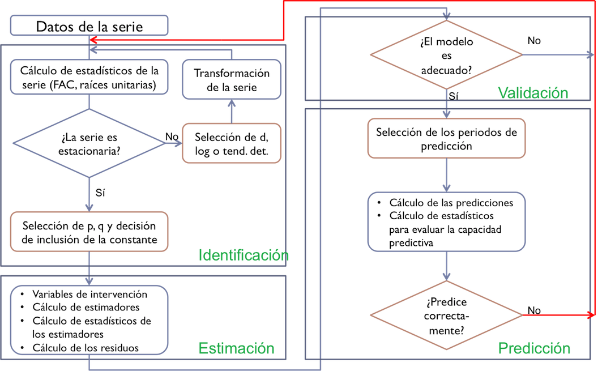

```{r chunk_setup, echo = FALSE}
knitr::opts_chunk$set(warning = FALSE, 
                      message = FALSE, 
                      comment = "",
                      fig.align = "center", 
                      fig.show = "hold",
                      fig.height = 4,
                      fig.width = 8,
                      out.width = "80%") 
```

```{r options_setup, echo = FALSE}
options(scipen = 999) #- para quitar la notacion cientifica
```

```{r librerias, echo = FALSE}
library(forecast)
library(ggplot2); theme_set(theme_bw())
library(gridExtra)
library(grid)
library(tseries)
library(aod)
```


# Introducción

Los __modelos ARIMA__ han mostrado ser uno se los métodos de ajuste de series temporales más valiosos desde que fueran formalizados en 1976 por Box y Jenkins, en su libro [Time series analysis, forecasting and control](http://www.amazon.com/Time-Analysis-Forecasting-George-Box/dp/0470272848). Además, dieron las pautas a seguir en el ajuste de una serie temporal para alcanzar buenas predicciones (véase epígrafe 5).

En este tema, y el siguiente, definiremos estos procesos y aprenderemos a identificarlos, estimarlos y hacer predicciones.

__Los procesos ARIMA son ahora el tronco de una amplia familia de procesos__ que requieren menos hipótesis para su aplicación: ARCH, GARCH, NGARCH,  IGARCH, EGARCH, GARCH-M, QGARCH, GJR-GARCH, TGARCH, fGARCH...

__Los procesos ARIMA y los métodos de Alisado Exponencial son complementarios__:

* Los modelos de Alisado lineales son casos especiales de modelos Arima,
* Los modelos de Alisado no lineales no tienen su contrapartida en modelos Arima
* Muchos modelos Arima no tiene contrapartida en los modelos de Alisado.  

\
\

# Operador Retardo

Definimos el __operador retardo__ $L$ como $Ly_t = y_{t-1}$, es decir, retrasa un periodo la serie. En inglés se denomina _lag operator_ (L) o _backward shift_ (B)

Así, se tiene que:
$$L^k y_t  = y_{t-k}.$$
$$\nabla y_t  = y_t - y_{t-1} = y_t - Ly_t = (1-L)y_t.$$
$$\nabla^d y_t  = (1-L)^d y_t. $$

La siguiente tabla muestra un sencillo ejemplo del efecto del operador retardo sobre la serie $y_t$
```{r, echo=FALSE}
data.frame(y = 1:7, lag1_y = c(NA, 1:6), lag2_y = c(NA,NA,1:5) )
```

\
\

# Hipótesis

\

## Sobre el proceso estocástico

A lo largo de este tema asumiremos que:

* $\{y_t\}_{t=1}^T$ es una realización de un proceso estocástico desconocido.
    
* El proceso estocástico es __estacionario en sentido amplio__:
$$E[y_t]  = \mu < \infty \;\;\; \forall t,$$
$$Cov[y_t, y_{t-k}]  = \gamma_k  \;\;\; \forall k.$$
     
* El proceso estocástico es __ergódico__, o su condición suficiente: 
$$\lim_{k \rightarrow \infty} \gamma_k  = 0.$$

\

## Sobre el vector de residuos

También asumiremos que el residuo del modelo $\{\varepsilon_t\}_{t=1}^T$ es __ruido blanco__:

* Media cero: $E[\varepsilon_t]=0$

\vspace{0.3cm}

* Varianza constante (homocedástico): $E[\varepsilon_t^2]=\sigma^2$

\vspace{0.3cm}

* Incorrelación: $E[\varepsilon_t \cdot \varepsilon_{s}]=0 \;\;\; t \neq s$

\vspace{0.3cm}

* Distribución Normal: $\varepsilon_t \sim N$

\vspace{0.3cm}

Es decir, $\varepsilon_t \sim N(0,\sigma^2)$ i.i.d.

\
\

# Procesos ARIMA

ARIMA surge de combinar las siglas de tres procesos diferentes: __AR__ de AutoRegresive, __I__ de Integrated y __MA__ de Moving Average. Veamos cada uno de estos tres conceptos por separado y luego su combinación. 

\

## Procesos autorregresivos AR(p)

### Definición {-}

El modelo general __autorregresivo de orden p__, $y_t \sim AR(p)$ viene definido por
$$y_t=c + \phi_1 y_{t-1} + \phi_2 y_{t-2} + ... + \phi_p y_{t-p} + \varepsilon_t,$$
\noindent que usando el operador retardo queda
$$(1 - \phi_1 L - \phi_2 L^2 - ... - \phi_p L^p)y_t = c + \varepsilon_t$$

### Propiedades {-}

El proceso es __estacionario__ si quedan fuera del círculo de radio la unidad todas las raíces del polinomio
$$\Phi_p(z) = 1 - \phi_1 z - \phi_2 z^2 - ... - \phi_p z^p.$$

Es __invertible__ siempre.

* Podemos transformar el proceso AR(p) en un proceso donde $y_t$ depende de la suma infinita de errores pasados, MA($\infty$).
* Si conocemos las p primeras autocorrelaciones, podemos estimar los p parámetros del modelo. Por ejemplo, para un proceso AR(2) se verifica que:
$$\rho_1 = \phi_1 + \phi_2 \rho_1$$
$$\rho_2 = \phi_1 \rho_1 + \phi_2$$

  Estas ecuaciones se denominan __Ecuaciones de Yule-Walker__.
  
  Observa que si tenemos una estimación de las dos primeras autocorrelaciones, estas ecuaciones nos permiten obtener una estimación de los coeficientes del proceso AR(2) como una aplicación del método de los momentos.

__Sobre todo__,

* La FAC del proceso decae _exponencialmente_ a partir del orden p
* La FACP verifica que los p primeros valores son no nulos y todos los demás valen cero.

### Simulación de procesos autorregresivos {-}

Las figuras 1 y 2 muestran dos simulaciones del proceso AR(1) con $y_t = 0.8y_{t-1} + \varepsilon_t$, la primera con 20 datos y la segunda con 100 datos. En ambos casos $\varepsilon_t$ se distribuye como una normal con media cero y varianza la unidad. (Todas las simulaciones se han realizado con la función `arima.sim` de la librería `stats`.)

```{r, echo = FALSE}
set.seed(111116)
y20 <- arima.sim(n = 20, list(ar = 0.8), innov = rnorm(20))
y100 <- arima.sim(n = 100, list(ar = 0.8), innov = rnorm(100))
y100a <- arima.sim(n = 100, list(ar = c(0.5, 0.4)), innov = rnorm(100))
y100b <- arima.sim(n = 100, list(ar = c(0.9, -0.5)), innov = rnorm(100))
```

```{r, echo = FALSE}
ggtsdisplay(y20, main = "Figura 1. AR(1) - n = 20")
ggtsdisplay(y100, main = "Figura 2. AR(1) - n = 100")
```

Las figuras 3 y 4 muestran dos simulaciones de procesos AR(2), ambas con 100 datos. En la primera se tiene que $y_t = 0.5y_{t-1} + 0.4 y_{t-2}+ \varepsilon_t$ y en la segunda $y_t = 0.9y_{t-1} - 0.5 y_{t-2}+ \varepsilon_t$.

```{r, echo = FALSE}
ggtsdisplay(y100a, main = "Figura 3. AR(2) - n = 100")
ggtsdisplay(y100b, main = "Figura 4. AR(2) - n = 100")
```

\

## Procesos en medias móviles MA(q)

### Definición {-}

El modelo general __en medias móviles de orden q__, $y_t \sim MA(q)$ viene definido por
$$y_t=c + \varepsilon_t + \theta_1 \varepsilon_{t-1} + \theta_2 \varepsilon_{t-2} + ... + \theta_q \varepsilon_{t-q},$$
\noindent que usando el operador retardo queda
$$y_t = c + (1 + \theta_1 L + \theta_2 L^2 + ... + \theta_q L^q) \varepsilon_t$$

### Propiedades {-}

El proceso es __invertible__ si quedan fuera del círculo de radio la unidad todas las raíces del polinomio
$$\Theta_q(z) = 1 + \theta_1 z + \theta_2 z^2 + ... + \theta_q z^q.$$

* Podemos transformar el proceso MA(q) en un proceso AR($\infty$).
* Si conocemos las q primeras autocorrelaciones, podemos estimar los q parámetros del modelo. Por ejemplo, para un proceso MA(2) se verifica que:
$$\rho_1 = \frac{\theta_1 + \theta_1\theta_2}{1 + \theta_1^2 + \theta_2^2}$$
$$\rho_2 = \frac{\theta_2}{1 + \theta_1^2 + \theta_2^2}$$

Es __estacionario__ siempre.
     
__Sobre todo__,

* La FAC verifica que los q primeros valores son no nulos y todos los demás valen cero.
* La FACP decae _exponencialmente_ a partir del orden q.

### Simulación de procesos en medias móviles {-}

Las figuras 5 y 6 ofrecen dos simulaciones del proceso MA(1) con $y_t = 0.8\varepsilon_{t-1} + \varepsilon_t$, la primera con 20 datos y la segunda con 100 datos. En ambos casos $\varepsilon_t$ se distribuye como una normal con media cero y varianza la unidad.

```{r, echo=FALSE}
set.seed(654321)
y20<-arima.sim(n=20,list(ma=0.8), innov=rnorm(20))
y100<-arima.sim(n=100,list(ma=0.8), innov=rnorm(100))
y100a <- arima.sim(n = 100, list(ma = c(0.5, 0.4)), innov = rnorm(100))
y100b <- arima.sim(n = 100, list(ma = c(0.9, -0.5)), innov = rnorm(100))
```

```{r, echo = FALSE}
ggtsdisplay(y20,main="Figura 5. MA(1) - n = 20")
ggtsdisplay(y100,main="Figura 6. MA(1) - n = 100")
```   

Veamos ahora dos simulaciones de procesos MA(2), ambas con 100 datos (figuras 7 y 8). En la primera se tiene que $y_t = 0.5\varepsilon_{t-1} + 0.4 \varepsilon_{t-2}+ \varepsilon_t$ y en la segunda $y_t = 0.9\varepsilon_{t-1} - 0.5 \varepsilon_{t-2}+ \varepsilon_t$.

```{r, echo = FALSE}
ggtsdisplay(y100a, main = "Figura 7. MA(2) - n = 100")
ggtsdisplay(y100b, main = "Figura 8. MA(2) - n = 100")
```

\

## Procesos ARMA(p,q)

### Definición {-}

El modelo general $y_t \sim ARMA(p,q)$ viene dado por
$$y_t = c + \phi_1 y_{t-1} + \phi_2 y_{t-2} + ... + \phi_p y_{t-p}  + 
        \theta_1 \varepsilon_{t-1} + \theta_2 \varepsilon_{t-2} + ... +
        \theta_q \varepsilon_{t-q}+ \varepsilon_t,$$
\noindent que usando el operador retardo queda
$$(1 - \phi_1 L - ... - \phi_p L^p)y_t = c + (1 + \theta_1 L + ... + \theta_q L^q) \varepsilon_t.$$

El proceso más simple es el ARMA(1,1), $y_t = c  + \phi_1 y_{t-1} + \theta_1 \varepsilon_{t-1} + \varepsilon_{t}$.


### Propiedades {-}

El proceso es __estacionario__ si quedan fuera del círculo de radio la unidad todas las raíces del polinomio
$$\Phi_p(z) = 1 - \phi_1 z - \phi_2 z^2 - ... - \phi_p z^p.$$
El proceso es __invertible__ si quedan fuera del círculo de radio la unidad todas las raíces del polinomio
$$\Theta_q(z) = 1 + \theta_1 z + \theta_2 z^2 + ... + \theta_q z^q.$$
__Sobre todo__,

* La FAC decae exponencialmente a partir del orden p.
* La FACP decae exponencialmente a partir del orden q.


### Simulación de procesos ARMA {-}

Las figuras 9 a 11 muestran las FAC y FACP de tres simulaciones de tamaño 200 para procesos ARMA(1,1), ARMA(2,1) y ARMA(1,2). En todos los casos $\varepsilon_t$ se distribuye como una normal con media cero y varianza la unidad.

```{r,echo=FALSE}
set.seed(654321)
y200a <- arima.sim(n = 200,list(ar = 0.7, ma = 0.6), innov = rnorm(200))
y200b <- arima.sim(n = 200,list(ar=c(0.7, -0.5), ma = 0.6), innov = rnorm(200))
y200c <- arima.sim(n = 200,list(ar = 0.6, ma = c(0.5, 0.3)), innov = rnorm(200))
```

$y_t = 0.7y_{t-1} + 0.6\varepsilon_{t-1} + \varepsilon_t$

```{r, echo = FALSE, fig.height=3}
grid.arrange(
  ggAcf(y200a, lag = 10, main = "Figura 9. Proceso ARMA(1, 1)", xlab = "Retardo", ylab = "FAC"),
  ggPacf(y200a, lag = 10, main = "", xlab = "Retardo", ylab = "FACP"),
  nrow = 1
)
```

$y_t = 0.7y_{t-1}- 0.5y_{t-2} + 0.6\varepsilon_{t-1} + \varepsilon_t$

```{r, echo = FALSE, fig.height=3}
grid.arrange(
  ggAcf(y200b, lag = 10, main = "Figura 10. Proceso ARMA(2, 1)", xlab = "Retardo", ylab = "FAC"),
  ggPacf(y200b, lag = 10, main = "", xlab = "Retardo", ylab = "FACP"),
  nrow = 1
)
```

$y_t = 0.6y_{t-1} + 0.5\varepsilon_{t-1} + 0.3\varepsilon_{t-2} + \varepsilon_t$

```{r, echo = FALSE, fig.height=3}
grid.arrange(
  ggAcf(y200c, lag = 10, main = "Figura 11. Proceso ARMA(1, 2)", xlab = "Retardo", ylab = "FAC"),
  ggPacf(y200c, lag = 10, main = "", xlab = "Retardo", ylab = "FACP"),
  nrow = 1
)
```  

\

## Proceso ARIMA(p,d,q)

__Si la serie $y_t$ no es estacionaria pero tras diferenciarla $d$ veces se hace estacionaria, diremos que la serie es integrada de orden $d$__: $y_t \sim I(d)$.

* Por tanto, una serie estacionaria se indicará como $y_t \sim I(0)$
* $y_t \sim I(d)$ es equivalente a $\nabla^d y_t = (1 - L)^d y_t \sim I(0)$

Una serie $y_t$ sigue un proceso __$ARIMA(p,d,q)$__ si:

1. $y_t \sim I(d)$ (hay que diferenciarla $d$ veces para hacerla estacionaria), y
2. $\nabla^d y_t \sim ARMA(p,q)$.
      
Entonces, podemos escribir: 
$$y_t \sim  ARIMA(p,d,q): \;\;\; (1 - \phi_1 L - \ldots - \phi_p L^p)(1- L)^d y_t = c + (1 + \theta_1 L + ... + \theta_q L^q) \varepsilon_t.$$
Veamos la FAC de tres series simuladas no estacionarias: un paseo aleatorio, un paseo aleatorio con deriva y un modelo lineal. Sus FAC son indistinguibles, pero en los tres casos revelan claramente su carácter no estacionario.

```{r, echo = FALSE}
y1 <- cumsum(rnorm(200))
y2 <- 1:200
```

```{r, echo = FALSE, fig.height=6}
grid.arrange(
  ggAcf(y1, lag = 10, main = "Figura 12. Series no estacionarias", xlab = "Paseo aleatorio", ylab = "FAC"),
  ggAcf(y2, lag = 10, main = "", xlab = "Determinista lineal", ylab = ""),
  ggAcf(y1 + y2, lag = 10, main = "", xlab = "Paseo aleatorio con deriva", ylab = ""),
  nrow = 3
)
``` 

\
\

# Aproximación de Box-Jenkins

La siguiente figura muestra el flujo de procesos asociado a la modelización por modelos ARIMA, con cuatro grandes áreas:

* __Identificación__, que requiere primero transformar la serie para que sea estacionaria y ergódica, para después identificar los valores de p y q.
* __Estimación__ de los parámetros del modelo, incluidas las variables de intervención y obtención del error.
* __Validación__ de las hipótesis sobre el residuo, contraste de significatividad de los parámetros estimados y comprobación de que no hay más intervención. Si la validación no se pasa, puede ser necesario volver al proceso inicial y realizar una nueva identificación del modelo.
* __Predicción__ e interpretación del modelo válido. Si las predicciones se alejan de los valores reales más de lo esperado o presentan sesgo, puede ser necesario identificar y estimar un nuevo modelo.



\
\

# Ejemplos

\

## Títulos de libros y panfletos

Vamos a aplicar la metodología de Box-Jenkins a la serie Libros (número de títulos publicados anualmente en España desde 1993 hasta 2018).


```{r}
libros <- read.csv2("./series/libros.csv", header = TRUE)
libros <- ts(libros["libros"], start = 1993, frequency = 1)

autoplot(libros,
         xlab = "", 
         ylab = "", 
         main = "Figura 13. Títulos publicados")
```

### Transformación de la serie {-}

El primer paso es transformar la serie original para que sea estacionaria. En el tema 3 ya vimos que la primera diferencia de la serie Libros es estacionaria y ergódica. Es decir, $d=1$ o $libros_t \sim I(1)$. Como recordatorio, la figura 14 muestra la gráfica temporal y la FAC para la serie original y su primera diferencia. 

```{r, eval = FALSE}
autoplot(libros, xlab = "", ylab = "", main = "Libros")
autoplot(diff(libros), xlab = "", ylab = "", main = "Diferencia libros")
ggAcf(libros, xlab = "", ylab = "FAC", main = "")
ggAcf(diff(libros), xlab = "", ylab = "FAC", main = "")
```

```{r, echo = FALSE}
grid.arrange(
  autoplot(libros, xlab = "Libros", ylab = "", main = "Figura 14. Títulos publicados"),
  autoplot(diff(libros), xlab = "Diferencia libros", ylab = "", main = ""),
  ggAcf(libros, xlab = "", ylab = "FAC", main = ""),
  ggAcf(diff(libros), xlab = "", ylab = "FAC", main = ""),
  nrow = 2
)
```

### Identificación {-}

Tras diferenciar la serie, vamos a identificar los valores de $p$ y $q$ a partir de las FAC y FACP de la serie diferenciada (figura 15). 

```{r} 
ggtsdisplay(diff(libros), main = "Figura 15. Libros (primera diferencia)")
```

Observamos que:

* En la FAC ninguna autocorrelación sobrepasa las líneas que marcan el intervalo de confianza al 95%.
* En la FACP tampoco las autocorrelaciones parciales sobrepasan el intervalo de confianza.
      
Parece, por tanto, ruido blanco, $p=q=0$. La identificación inicial es $libros_t \sim ARIMA(0,1,0)$, paseo aleatorio, inicialmente asumiremos que con deriva:
$$libros_t = c + libros_{t-1} + \varepsilon_t$$

### Estimación {-}

Aunque existe la función `arima` de `stats`, vamos a usar la función `Arima` de la librería `forecast` para estimar el modelo identificado por ser más versátil. El argumento `order` indica los valores de (p, d , q) como un vector y el argumento lógico `include.constant` fuerza a que se incluya la constante $c$ en el modelo. (Mira en la ayuda de la función `Arima` la diferencia entre los argumentos `include.mean`, `include.drift` e `include.constant`).

```{r}
arima010 <- Arima(libros, 
                 order=c(0, 1, 0), 
                 include.constant = TRUE)
arima010
```

La deriva no parece ser significativa, dado que su valor estimado no es mayor que dos veces el error estándar (s.e.).

La prueba de Wald permite contrastar si un subconjunto de coeficientes es significativo (se precisa la librería `aod`). Esta función requiere de tres argumentos: el vector de coeficientes (`b`), su matriz de covarianzas (`Sigma`) y la posición de los coeficientes cuya significatividad conjunta deseamos contrastar (`Terms`). Los dos primeros argumentos los podemos obtener del objeto `arima010` con las funciones `coef` y `vcov`. 

Vamos a usar la función `test.wald` para contrastar si la contante (primer y único coeficiente del modelo) es significativo.
  
```{r}
wald.test(b = coef(arima010), 
          Sigma = vcov(arima010), 
          Terms = 1)
```

Como el valor de p, igual a `r round(wald.test(b = coef(arima010), Sigma = vcov(arima010), Terms = 1)$result$chi2[3], 3)` es mayor que la significatividad $\alpha =$ 0.05, se concluye que la constante no es significativa, no hay deriva. 

Re-estimamos el modelo como un paseo aleatorio sin deriva,

```{r}
arima010 <- Arima(libros, 
                 order=c(0, 1, 0), 
                 include.constant = FALSE)
arima010
```

Nuestro modelo estimado es: $\widehat{libros}_t = libros_{t-1}$ ¡el método ingenuo I!

### Validación {-}

Veamos si el residuo verifica todas las hipótesis indicadas en el epígrafe 3.2

__Media cero__

No se puede contrastar si el residuo tiene __media cero__, pero el error medio es $ME=$ `r round(accuracy(arima010)[1],2)`, relativamente bajo en comparación con el valor medio de la serie.

Además, tenemos las diferentes medidas de bondad del ajuste. En media nos equivocamos en `r round(accuracy(arima010)[2],0)` títulos (RMSE) y el error porcentual medio (MAPE) es `r round(accuracy(arima010)[5],1)`%.

```{r,eval=FALSE}
accuracy(arima010)
```

```{r,echo=FALSE}
round(accuracy(arima010),2)
```
  
\

__Incorrelación__. 

Lo veremos con el test de Box-Ljung

* La hipótesis nula es $H_0: \rho_1 = ... = \rho_k = 0$
* El valor de p = `r round(Box.test(residuals(arima010), lag = 2,type = "Ljung-Box")$p.value, 3)` es mayor que el nivel de significatividad 0.05. No se rechaza la hipótesis de incorrelación, hasta el orden $k = 2$.

```{r}
error <- residuals(arima010)
Box.test(error, lag = 2,type = "Ljung-Box")
```
    
La elección de dos retardos para la prueba, fijado con el parámetros `lag = 2`, es bastante arbitraria. Sería mejor realizar la prueba para un rango de valores de $k$:
    
```{r,echo = FALSE}
pp <- rep(0,4)
for (i in 1:4) pp[i] <- round(Box.test(error, lag = i, type = "Ljung-Box")$p.value, 3)
data.frame(k = 1:4, "valor de p" = pp)
```

\

__Homocedasticidad__ (varianza constante).

Lo veremos con el test de Box-Ljung para el residuo al cuadrado. La hipótesis nula seria que las primeras $k$ autocorrelaciones estimadas sobre el cuadrado del residuo son cero.

El valor de p = `r round(Box.test(error^2, lag = 2,type = "Ljung-Box")$p.value, 3)` es mayor que el nivel de significatividad 0.05. No se rechaza la  hipótesis de homocedasticidad, hasta el orden 2.

```{r}
Box.test(error^2, lag = 2, type = "Ljung-Box")
```

De nuevo, la elección de dos retardos es totalmente arbitraria y sería mejor realizar la prueba para un rango de valores de $k$.
    
```{r,echo = FALSE}
pp <- rep(0,4)
for (i in 1:4) pp[i] <- round(Box.test(error^2, lag = i, type = "Ljung-Box")$p.value, 3)
data.frame(k = 1:4, "valor de p" = pp)
```

\

__Normalidad__

Recuerda que todos las pruebas de normalidad son muy sensibles al tamaño de la muestra. Siempre es recomendable empezar por un análisis gráfico (histograma, gráfico PP, gráfico QQ).

Sin embargo, cuando es necesario un criterio más objetivo o se precisa de un proceso automático, entonces si la muestra es reducida (30 a 50 observaciones según autores) se aplica la prueba de Shapiro-Wilk; en otro caso se aplica la prueba de Jarque-Bera (`tseries`) o Kolmogorov-Smirnov. En nuestro ejemplo, con 26 datos, lo correcto es aplicar la prueba de Shapiro-Wilk. También hemos aplicado Jarque-Bera para que veas como la conclusión difiere según la prueba empleada.

```{r}
shapiro.test(error)
jarque.bera.test(error)
```

\

__Intervención__

Se analiza si para algún año se observa un error atípico  (por ejemplo 3 veces superior al error estándar). La figura 16 muestra que en este caso en dos periodos, años 2008 y 2013, el residuo sobrepasa los dos errores estándar pero queda lejos de los tres errores estándar así que asumiremos que no hay valores atípicos.

```{r}
sderror <- sd(error)

autoplot(error, series="Error",
         colour = "black",
         xlab = "",
         ylab = "Error",
         main = "Figura 16. Error + Intervención") +
  geom_hline(yintercept = c(-3, -2, 2, 3)*sderror, 
             colour = c("red", "green", "green", "red"), 
             lty = 2) + 
  geom_point() +
  scale_x_continuous(breaks= seq(1993, 2019, 2)) 
```

### Predicción {-}

Una vez validado el modelo podemos pasar a realizar __predicciones__, en este caso a 5 años vista.

```{r}
parima010 <- forecast(arima010, h = 5, level = 95)
parima010
```

```{r}
autoplot(parima010, 
         xlab = "", 
         ylab = "Títulos",
         main = "Figure 17. Libros (1993-2018) y predicción (2019-2023)") +
  scale_x_continuous(breaks= seq(1993, 2023, 2)) 
```


La figura 17 muestra la serie, la previsión y el intervalo de confianza al 95%. En las series diferenciadas el intervalo de confianza de las predicciones crece muy rápidamente porque los errores se van acumulando sin ningún tipo de amortiguamiento. 

### Identificación automática {-}

El paquete `forecast` dispone de la función `auto.arima()` que localiza el mejor modelo basándose en el AIC corregido para pequeñas muestras (`AICc`). No hay que fiarse ciegamente de los resultados de esta función, pero ayuda en la identificación. Básicamente el algoritmo seguido es el siguiente:

1. Determina el orden de diferenciación regular $0 \leq d \leq 2$ usando la función `ndiffs`, que usa la prueba KPSS repetidas veces. 
2. Tras diferenciar la serie:
    * se estiman una serie de modelos básicos predeterminados. 
    * se usa el criterio AICc para seleccionar el mejor de estos modelos. 
    * a partir del modelo seleccionado, se hacen pequeñas variaciones modificando en una unidad _p_ y _q_ y añadiendo/quitando la constante y se vuelve a seleccionar el mejor de los nuevos modelos.
3. Se repite el paso 2 hasta que no se puede mejorar el AICc. 

Otras cuestiones a tener en cuenta son:

* La función `auto.arima` no permite contante si la suma de las diferenciaciones es 2 o superior. 
* Si se desea hacer una búsqueda exhaustiva entre todos los posibles modelos se debe usar el argumento `stepwise = FALSE`.
* Si se desea que el cálculo de AICc sea exacto (por defecto para ganar tiempo calcula una aproximación), se debe usar el argumento `approximation = FALSE`.
* Si se desea ver para todos los modelos analizados el valor de AICc, se debe incluir el argumento `trace = TRUE`.

La función `auto.arima` tiende a sobre-parametrizar los modelos y es muy recomendable _ayudarla_ indicando las diferenciaciones, los posibles valores extremos... 


```{r}
auto.arima(libros, trace = TRUE)
```

Observa como la identificación automática da como mejor modelo un ARIMA(0,1,0), que es el habíamos identificado, y como segunda opción el mismo modelo pero con deriva.
  
\

## Aforo de vehículos

Vamos a aplicar de nuevo la metodología de Box-Jenkins a la serie __aforo de vehículos__ por Oropesa, carretera N-340, km. 996,48 (fuente Ministerio de Fomento). La serie es anual de 1960 a 2018 (59 datos).
    
```{r}
aforo <- read.csv2("./series/aforo_oropesa.csv", header = TRUE)
aforo <- ts(aforo, start = 1960, freq = 1)

autoplot(aforo, 
         xlab = "", 
         ylab = "Vehículos (000)",
         main = "Figura 18. Aforo de vehículos en N-340, Oropesa")
```


En este ejemplo vamos a trabajar con el logaritmo de la serie para poder ver algunos detalles relacionados con la interpretación del modelo y la predicción. Además, incluiremos, por primera vez, intervención y veremos como __la presencia de valores atípicos puede distorsionar el proceso de identificación__. Por ello, es conveniente realizar en paralelo ambas actividades, identificar el proceso y detectar valores atípicos.
      
### Transformación de la serie {-}

La figura 18 muestra que la serie Aforo (log) no es estacionaria. Así, el primer paso es transformar la serie original para que lo sea. La figura 19 no deja claro si la primera diferencia es suficiente para alcanzar la estacionariedad (gráficos de la segunda columna). Sin embargo, tras diferenciar dos veces la serie es claramente estacionaria. Por tanto se opta por considerar $d=2$ o $log(aforo_t) \sim I(2)$. La función `ndiffs` también aconseja la doble diferenciación.

```{r, eval = FALSE}
autoplot(log(aforo), 
         xlab = "log(Aforo)", ylab = "", main = "")
autoplot(diff(log(aforo)), 
         xlab = "Una diferencia de log(Aforo)", ylab = "", main = "")
autoplot(diff(log(aforo), differences = 2), 
         xlab = "Dos diferencias de log(Aforo)", ylab = "", main = "")
ggAcf(log(aforo), xlab = "", ylab = "FAC", main = "")
ggAcf(diff(log(aforo)), xlab = "", ylab = "FAC", main = "")
ggAcf(diff(log(aforo), differences = 2), xlab = "", ylab = "FAC", main = "")
```

```{r, echo = FALSE}
grid.arrange(
  autoplot(log(aforo), xlab = "log(Aforo)", ylab = "", main = "Figura 19. Aforo de vehículos"),
  autoplot(diff(log(aforo)), xlab = "Una diferencia de log(Aforo)", ylab = "", main = ""),
  autoplot(diff(log(aforo), differences = 2), xlab = "Dos diferencias de log(Aforo)", ylab = "", main = ""),
  ggAcf(log(aforo), xlab = "", ylab = "FAC", main = ""),
  ggAcf(diff(log(aforo)), xlab = "", ylab = "FAC", main = ""),
  ggAcf(diff(log(aforo), differences = 2), xlab = "", ylab = "FAC", main = ""),
  nrow = 2
)
```


### Identificación {-}

Veamos ahora a identificar los valores de $p$ y $q$ a partir de la FAC y la FACP. La FAC podemos considerar tiene una sola autocorrelación significativa en el orden 1, y la FACP que presenta decrecimiento. Podría tratarse de un proceso MA(1).

```{r} 
ggtsdisplay(diff(log(aforo), differences = 2), 
            main = "Figura 20. Aforo (log y dos diferencias)")
```

¿Qué recomienda `auto.arima`? Sugiere un proceso MA(2), con ambos coeficientes significativos.

```{r} 
auto.arima(aforo, lambda = 0)
```


Vamos a ver la gráfica de los residuos del modelo MA(2), vamos a identificar los valores extremos (intervención) y vamos a solicitar una vez más la auto-identificación pero incluyendo las variables ficticias asociadas a cada valor extremo.


```{r}
arima022 <- Arima(aforo, 
                  order = c(0, 2, 2),
                  lambda = 0)

error <- residuals(arima022)
sderror <- sd(error)

autoplot(error, series="Error",
         colour = "black",
         xlab = "",
         ylab = "Error",
         main = "Figura 21. Error + Intervención") +
  geom_hline(yintercept = c(-3, -2, 2, 3)*sderror, 
             colour = c("red", "green", "green", "red"), 
             lty = 2) + 
  geom_point() +
  scale_x_continuous(breaks= seq(1960, 2014, 4)) 
```

Se identifican dos posibles valores extremos en los años 1979 y 1981. Además, vamos a incluir otras dos intervenciones para los años 1984 y 2011 porque si no serían necesarias más adelante. Entonces, creamos una variable ficticia asociada a cada año d1979, d1981, d1984 y d2011, y las incluimos en la auto-identificación.

```{r}
d1979 <- 1*(time(error) == 1979)
d1981 <- 1*(time(error) == 1981)
d1984 <- 1*(time(error) == 1984)
d2011 <- 1*(time(error) == 2011)

auto.arima(aforo, lambda = 0, xreg = cbind(d1979, d1981, d1984, d2011))
```

Observa como la inclusión de intervención modifica la auto-identificación, que ahora es un proceso ARIMA(1,2,0). Así, ahora tememos el modelo identificado a partir de la FAC y la FACP ARIMA(0,2,1) y el modelo auto-identificado ARIMA(1,2,0). Un análisis de la calidad de las previsiones y del comportamiento del residuo indica que el segundo proceso es más adecuado. Por tanto, asumimos que $log(aforo_t) \sim ARIMA(1,2,0)$ con intervención.

### Estimación {-}

```{r}
arima120 <- Arima(aforo, 
                  order = c(1, 2, 0), 
                  lambda = 0,  
                  xreg = cbind(d1979, d1981, d1984, d2011))
arima120
```

Se puede comprobar que todas las variables son significativas.

```{r}
#H0: phi1 = 0
wald.test(b = coef(arima120), Sigma = vcov(arima120), Terms = 1)
#H0: d1979 = 0
wald.test(b = coef(arima120), Sigma = vcov(arima120), Terms = 2)
#H0: d1981 = 0
wald.test(b = coef(arima120), Sigma = vcov(arima120), Terms = 3)
#H0: d1984 = 0
wald.test(b = coef(arima120), Sigma = vcov(arima120), Terms = 4)
#H0: d2011 = 0
wald.test(b = coef(arima120), Sigma = vcov(arima120), Terms = 5)
```

### Validación {-}

Veamos que el residuo verifica todas las hipótesis.

__Intervención__ 

La figura 22 muestra que para ningún año se observa un error atípico. El residuo más elevado en 1974 si se incluye, no resulta significativo.

```{r}
error <- residuals(arima120)
sderror <- sd(error)

autoplot(error, series="Error",
         colour = "black",
         xlab = "",
         ylab = "Error",
         main = "Figura 22. Error + Intervención") +
  geom_hline(yintercept = c(-3, -2, 2, 3)*sderror, 
             colour = c("red", "green", "green", "red"), 
             lty = 2) + 
  geom_point() +
  scale_x_continuous(breaks= seq(1960, 2014, 4)) 
```

\

__Medidas de error__

El error medio es `r round(accuracy(arima120)[2],0)` miles de vehículos (RMSE) y el error porcentual medio (MAPE) es `r round(accuracy(arima120)[5],2)`%.

```{r, eval=FALSE}
accuracy(arima120)
```

```{r,echo=FALSE}
round(accuracy(arima120),2)
```

\

__Incorrelación, Homocedasticidad y Normalidad__

Veamos ahora si el residuo es ruido blanco:

```{r}
Box.test(error, lag = 2, type = "Ljung-Box")
Box.test(error^2, lag = 2, type = "Ljung-Box") 
jarque.bera.test(error)
```


Las hipótesis de incorrelación y homocedasticidad se aceptan. También se aceptarían para otros valores de $k$ razonables. Igualmente, se acepta la hipótesis de normalidad. 

### Interpretación del modelo {-}

El __modelo teórico__ es $log(aforo_t) \sim ARIMA(1,2,0) + d1979 + d1981 + d9184 + d2011$:
$$(1 - \phi_1 L)(1 - L)^2 log(aforo_t) =  \varepsilon_t + \gamma_1 \cdot d1979 + \gamma_2 \cdot d1981 + \gamma_3 \cdot d1984 + \gamma_4 \cdot d2011.$$

Si sustituimos $(1 - L)^2 log(aforo_t)$ por $(1 - L) TVAaforo_t$, donde $TVAaforo$ es la tasa de variación anual del aforo, y desarrollamos, queda:
$$TVAaforo_t = TVAaforo_{t-1} + \phi_1(TVAaforo_{t-1}-TVAaforo_{t-2}) +$$
$$\gamma_1 \cdot d1979 + \gamma_2 \cdot d1981 + \gamma_3 \cdot d1984 + \gamma_4 \cdot d2011 + \varepsilon_t.$$

Finalmente. el __modelo estimado__ es:
$$\widehat{TVAaforo}_t = TVAaforo_{t-1} -0.66(TVAaforo_{t-1}-TVAaforo_{t-2}) + $$
$$ - 0.15 \cdot d1979 + 0.08 \cdot d1981 + 0.08 \cdot d1984 - 0.09 \cdot d2011.$$
Cada año la tasa de variación del aforo es el misma que la del año pasado menos un 66% del último incremento entre las tasas de variación.
    
Respecto de la intervención, en 1979 hubo un 15% menos de vehículos de lo esperado, en 1981 y 1984 en torna a un 8% más de vehículos y en 2011 un 9% menos.
      

### Predicción {-}

Como hemos incluido cuatro variables ficticias en el ajuste, de cara a predecir el aforo hemos de indicar cuales serán los valores futuros para estas variables. En este caso serán ceros puesto que son intervenciones que no responden a efectos calendario.
  
En `R` esto se hace incluyendo en el comando `forecast` el argumento `xreg = cbind(rep(0, 5), rep(0, 5), rep(0, 5), rep(0, 5))` que añade cinco ceros por cada variable de intervención porque la predicción va a ser a cinco años vista.

```{r}
parima120 <- forecast(arima120, 
                      h = 5, 
                      level = 95,
                      xreg = cbind(d1979=rep(0, 5), d1981=rep(0, 5), 
                                   d1984=rep(0, 5), d2011=rep(0, 5)))
parima120
```

```{r}
autoplot(parima120, 
     ylab = 'Vehículos (000)',
     main = 'Figura 23. Aforo (1960-2018) y predicción (2019-2023)') +
  scale_x_continuous(breaks= seq(1960, 2023, 4)) 
```

\

## Consumo de alimentos en el hogar per cápita

Analizaremos el __consumo alimentario en hogar per cápita__ en España. Esta serie está construida a partir de la serie de consumo alimentario en hogar (disponible en el Ministerio de Agricultura, Alimentación y Medio Ambiente), y la serie de población (disponible en el Instituto Nacional de Estadística). Es una serie anual de 1987 a 2018 (32 datos) y la unidad es el Kg per cápita. La figura 24 muestra que es una serie muy irregular, con cambios de tendencia constantes.

```{r}
alimentospc <- read.csv2("./series/alimentacionpc.csv", header = TRUE)
alimentospc <- ts(alimentospc, start = 1987, freq = 1)
    
autoplot(alimentospc, 
         xlab = "", 
         ylab = "Kg per cápita",
         main = "Figura 24. Consumo alimentario en hogar")
```

### Transformación de la serie {-}

La figura 25 indica que la serie original ya es estacionaria. El contraste KPSS así lo confirma, por tanto asumimos que $d=0$ o $alimentospc_t \sim I(0)$.

```{r, eval = FALSE}
autoplot(alimentospc, xlab = "", ylab = "", main = "Alimentos")
autoplot(diff(alimentospc), xlab = "", ylab = "", main = "Diferencia alimentos")
ggAcf(alimentospc, xlab = "", ylab = "FAC", main = "")
ggAcf(diff(alimentospc), xlab = "", ylab = "FAC", main = "")
```

```{r, echo = FALSE}
grid.arrange(
  autoplot(log(alimentospc), xlab = "Alimentos", ylab = "", main = "Figura 25. Consumo de alimentos"),
  autoplot(diff(log(alimentospc)), xlab = "Diferencia de alimentos", ylab = "", main = ""),
  ggAcf(log(alimentospc), xlab = "", ylab = "FAC", main = ""),
  ggAcf(diff(log(alimentospc)), xlab = "", ylab = "FAC", main = ""),
  nrow = 2
)
```

### Identificación {-}

Para identificar los valores de $p$ y $q$ analizaremos la FAC y la FACP y veremos que nos sugiere `auto.arima` :

```{r} 
ggtsdisplay(alimentospc, main = "Figura 26. Consumo de alimentos per cápita")
```


```{r} 
auto.arima(alimentospc)
```

Es difícil realizar una identificación a partir del análisis de la FAC y FACP. La identificación automática sugiere un proceso AR(1) con constante y ambos coeficientes parecen significativos.

Vamos a ver la gráfica de los residuos de este proceso para identificar rápidamente si hay valores extremos (figura 27).


```{r}
arima100 <- Arima(alimentospc, 
                  order = c(1, 0, 0))

error <- residuals(arima100)
sderror <- sd(error)

autoplot(error, series="Error",
         colour = "black",
         xlab = "",
         ylab = "Error",
         main = "Figura 27. Error + Intervención") +
  geom_hline(yintercept = c(-3, -2, 2, 3)*sderror, 
             colour = c("red", "green", "green", "red"), 
             lty = 2) + 
  geom_point() +
  scale_x_continuous(breaks= seq(1987, 2018, 3)) 
```

Ningún residuo supera las 2.5 desviaciones típicas así que consideraremos que $alimentospc_t \sim ARIMA(1,0,0)$.

### Validación {-}

__Coeficientes significativos__

Tanto $\phi_1$ como $\mu$ (la constante del modelo) son significativos.

```{r}
wald.test(b = coef(arima100), Sigma = vcov(arima100), Terms = 1)
wald.test(b = coef(arima100), Sigma = vcov(arima100), Terms = 2)
```

\

__Medidas de error__

El error medio es $RMSE=$ `r round(accuracy(arima100)[2],0)` kilos per cápita y el error porcentual medio es $MAPE=$ `r round(accuracy(arima100)[5],1)`%.

```{r, eval=FALSE}
accuracy(arima100)
```

```{r,echo=FALSE}
round(accuracy(arima100),2)
```

\

__Incorrelación, Homocedasticidad y Normalidad__

Veamos ahora si el residuo es ruido blanco:

```{r}
Box.test(error, lag = 2, type = "Ljung-Box")
Box.test(error^2, lag = 2, type = "Ljung-Box") 
shapiro.test(error)
```


Las hipótesis de incorrelación y homocedasticidad se aceptan. También se aceptarían para otros valores de $k$ razonables. La hipótesis de normalidad se rechaza 5%.

### Interpretación del modelo {-}

El __modelo teórico__ identificado es $alimentospc_t \sim ARIMA(1,0,0)$ + constante:
$$(1 - \phi_1 L) alimentospc_t = c + \varepsilon_t,$$

que desarrollando queda:
$$alimentospc_t = c + \phi_1 alimentospc_{t-1}+ \varepsilon_t.$$

Finalmente. el __modelo estimado__ es:
$$\widehat{alimentospc}_t = 225.21 + 0.65 \cdot alimentospc_{t-1}$$

__Observación__: El término contante $\mu$ que estima R no es el valor de "c" que hemos visto en la teoría. Para convertir la contante estimada por R en "c" hemos de multiplicarla por el polinomio autoregresivo. En este caso,
$$c = \mu \cdot (1 - \phi_1) = 639.2512\cdot(1 - 0.6477) = 225.2082.$$

Cada año el consumo de alimentos per cápita en el hogar es 225 kilos más un 65% del consumo del año pasado.

### Predicciones de la serie {-}


```{r}
parima100 <- forecast(arima100, h = 5, level = 95)
parima100
```

Puedes comprobar que cada valor de la predicción se ha obtenido a partir del modelo estimado, donde $alimentospc_{t-1}$ se sustituye por la predicción del año precedente.

```{r}
autoplot(parima100, 
     ylab = "Kilos per cápita",
     main = "Figura 28. Consumo de alimentos y predicción") +
  scale_x_continuous(breaks= seq(1987, 2023, 4)) 
```

\

## Comparación con alisado exponencial

Veamos una comparativa, para los tres ejemplos vistos, entre los resultados obtenidos con ARIMA y con Alisado exponencial.
  
* Libros:
    + MAPE ARIMA: $7.02\%$ - ARIMA(0,1,0) sin deriva
    
    + MAPE ETS:   $7.05\%$ - ETS(M,N,N), $\alpha=1$
    
    + Ambos métodos han estimado el mismo modelo.

* Aforo (log):
    + MAPE ARIMA: $5.24\%$ - ARIMA(1,2,0) sin deriva, con intervención
    
    + MAPE ETS:   $5.73\%$ - ETS(A,Ad,N), $\alpha=0.57$, $\beta=0.57$, $\phi = 0.85$
    
    + Cada método estima un modelo diferente
    
    + ARIMA tiene menor error a costa de incluir cuatro variables de intervención

* Alimentos per cápita:
    + MAPE ARIMA: $1.37$ - ARIMA(1,0,0) con constante
    
    + MAPE ETS:   $1.43$ - ETS(M,N,N), $\alpha = 1$
    
    + Cada método ha estimado un modelo diferente, pero con una bondad de ajuste similar.


\
\

# Resumen de los comandos utilizados


|Función        |         |Descripción                                             |
|:--------------|:-------------------|:-------------------------------------------------------|
|`arima.sim`    |stats  |genera una simulación de un proceso ARIMA               |
|`Arima`        |forecast  |estima un proceso ARIMA |
|`auto.arima`   |forecast  |identificación automática de un modelo ARIMA          |
|`wald.test`    |aod    |contrasta la significatividad conjunta de varios parámetros|
|`forecast`     |forecast  |realiza una predicción de un modelo|
|`Box.test`     |stats  |prueba de independencia de una serie temporal           |
|`shapiro.test` |stats  |prueba de normalidad de Shapiro-Wilks                   |
|`jarque.bera.test` |tseries    |prueba de normalidad de Jarque-Bera          |

\
\


# Referencias

* Box, G. E.P. y Jenkins, G. (1976). _Time Series Analysis: Forecasting and Control_  Editado por Holden-Day, San Francisco, CA

\
\
\
\


